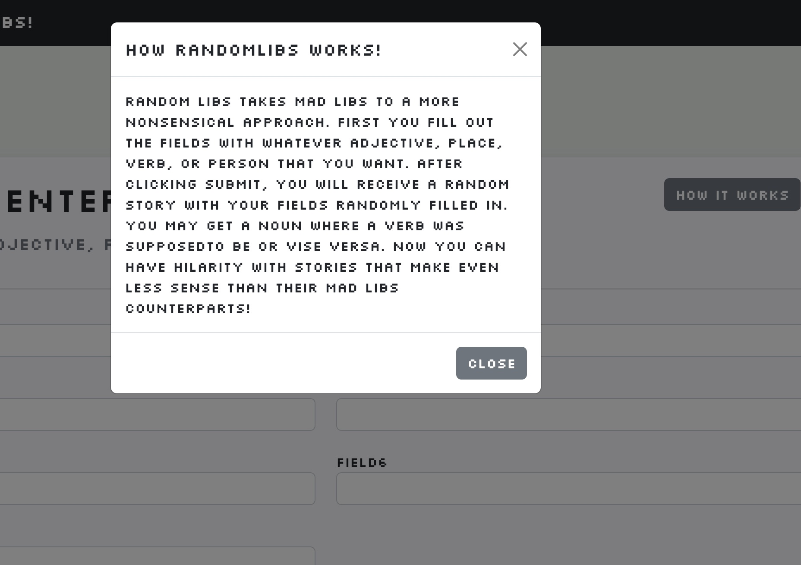

# Django Randomlibs

## CS3620 Project 2

### Description

For our second project we were given the task of creating a randomlibs game, and then it was up to us to go wild with it. I decided to create a different take where people could enter in random words in the fields, whether they be nouns, verbs, or adjectives, and then see a nonsensical paragraph pop out afterwards. I thought that this would be an easy way to capture the madlibs spirit, but tweak it slightly for more fun and laughs. Once the words are filled out, a random story is chosen with all the words filled in. There are about 12 stories in total with each picked randomly.

### Technologies Used

This app was built using the Django Stack with a SQLLite Database

- Python3 - Python, necessary for using django as it is built with python.
- Django - A python framework for building web applications.
- SQLLite - A lite database solution that was used to store all the stories.

### Challenges

The main challenge here was figuring out how to populate the empty fields in each story with the words provided. As some stories had more words than others, I had to be able to repeat words so that the 7 words given would always be enough to populate a story.

I decided that each story would be filled in with a pattern indicating where each word should go. So I would first grab the story, loop through the fields and place them into the slots as needed. If there were more slots then fields available, it would loop back around again.

### Screenshots

<table>
  <tr>
    <td></td>
    <td></td>
  </tr>
  <tr>
    <td></td>
    <td></td>
  </tr>
</table>
